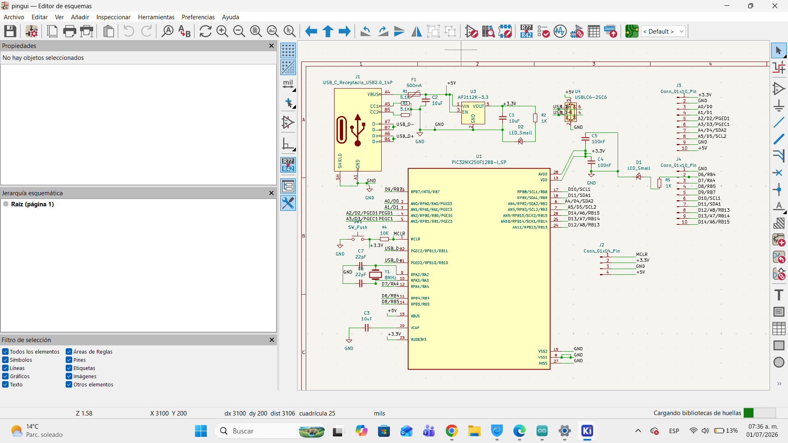
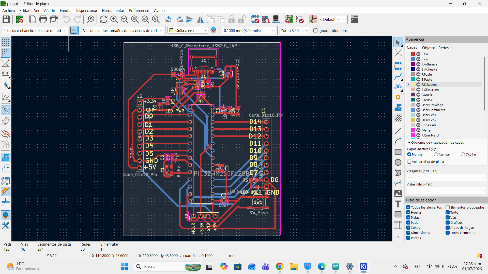
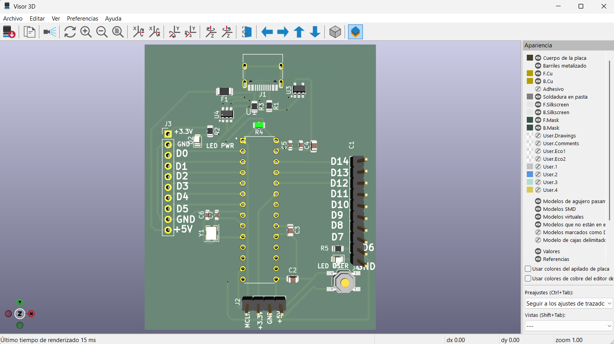
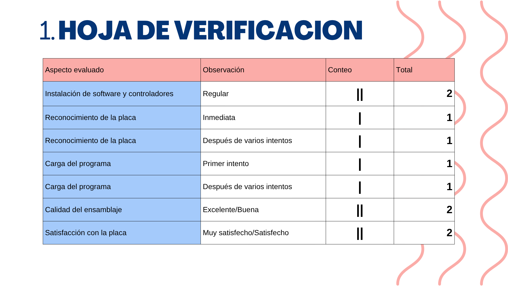
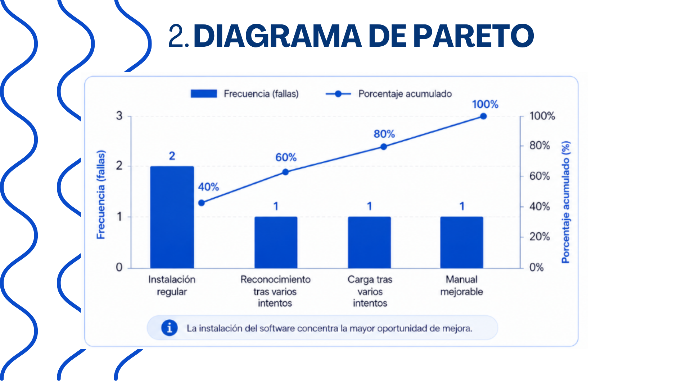
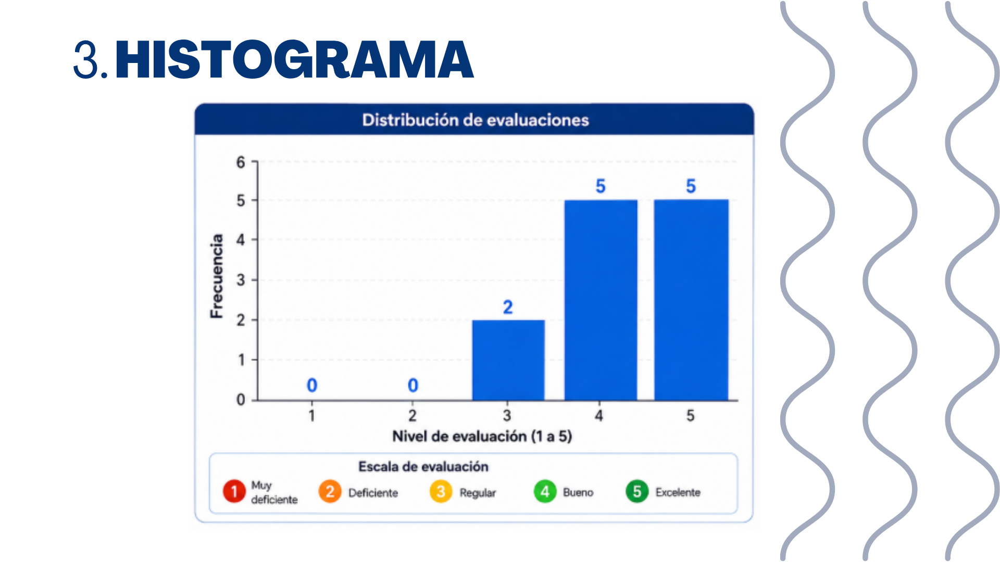
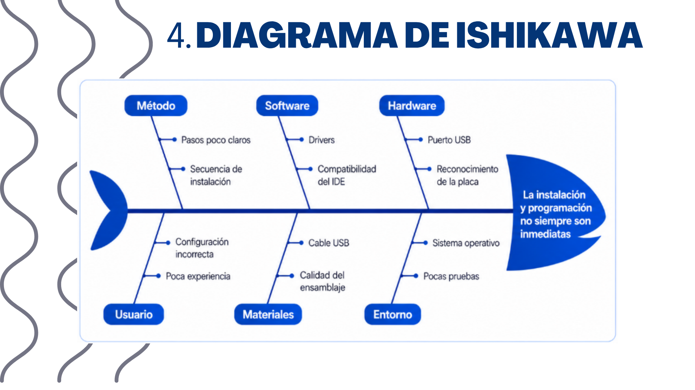
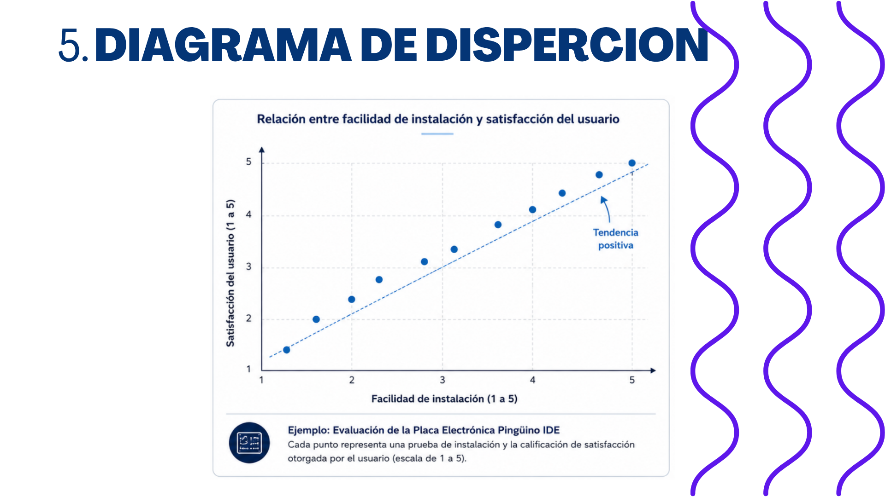
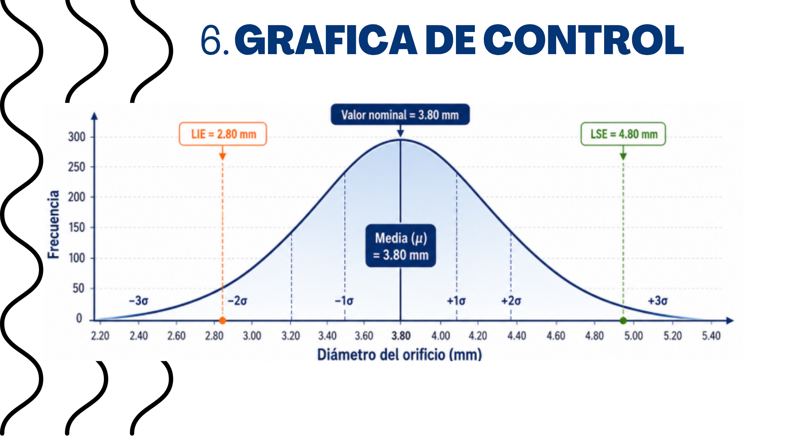
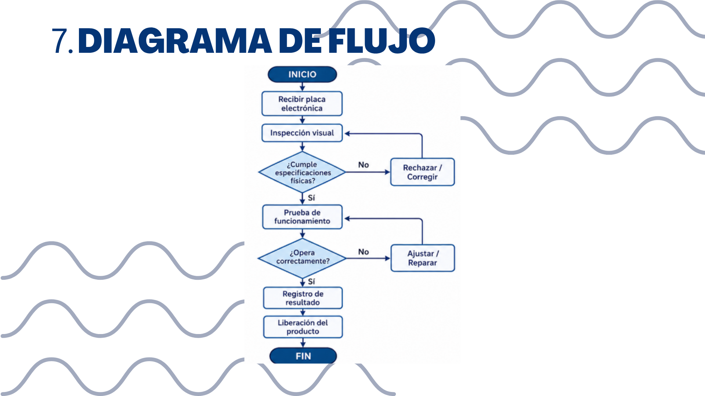

# 🐧 Proyecto Pinguino 32 Bits 
Contacto: 7751510126

---

# 📌 Descripción del Proyecto

El presente proyecto consiste en el diseño y desarrollo de una placa compatible con **Pinguino IDE**, basada en un microcontrolador de arquitectura de 32 bits de la familia **PIC32**.  

La tarjeta permitirá la programación mediante conexión USB, facilitando el desarrollo de sistemas embebidos de bajo costo para aplicaciones académicas, educativas y de prototipado electrónico.

Además, se busca implementar una alternativa funcional y accesible para estudiantes interesados en microcontroladores, sistemas digitales y comunicación serial.

---

# 🎯 Objetivo General

Diseñar e implementar una tarjeta compatible con **Pinguino IDE** utilizando un microcontrolador PIC32 de 32 bits, permitiendo la programación mediante USB y el desarrollo de aplicaciones embebidas.

---

# ✅ Objetivos Específicos

- Diseñar el circuito electrónico del sistema.
- Implementar la comunicación USB.
- Configurar el bootloader de Pinguino.
- Realizar pruebas de funcionamiento.
- Verificar la compatibilidad con Pinguino IDE.
- Elaborar documentación técnica del proyecto.
- Optimizar el diseño para bajo costo y fácil implementación.

---

# 🏛️ Misión

Desarrollar una plataforma electrónica basada en arquitectura PIC32 que facilite el aprendizaje y desarrollo de sistemas embebidos mediante herramientas de software libre y hardware accesible.

---

# 🔭 Visión

Convertirse en una alternativa educativa y tecnológica para estudiantes y desarrolladores interesados en microcontroladores de 32 bits, promoviendo el aprendizaje de programación embebida y diseño electrónico.

---

# ⚡ Características Principales

- 🧠 Arquitectura de 32 bits.
- 🔌 Comunicación USB integrada.
- 💻 Compatible con Pinguino IDE.
- ⚙️ Programación sencilla mediante bootloader.
- 💲 Bajo costo de implementación.
- 📡 Aplicable en proyectos de electrónica y telecomunicaciones.
- 🔋 Alimentación mediante USB.
- 🛠️ Diseño adaptable y escalable.

---

# 💻 Software Utilizado

- 🐧 Pinguino IDE
- 🛠️ PICkit 2
- 📐 KiCad / Eagle *(según el utilizado)*
- 📊 GitHub para control de versiones                                                       Para poder isntalar el Pinguino IDE se tiene que seguir una serie de pasos, con ayuda de este manual [ Ver MANUAL(PDF)](https://github.com/2330759/PROYECTO-PINGUINO_SOTO_LOZADA_SOSA/blob/77b822736eb000699e5ce5eb6b83666f4a34e7d7/ALONDRA/Manual%20de%20instalacion%20Pinguino%201.0.pdf)
Este archivo se encuentra en la carpeta de "Alondra: Manual de Pinguino 0.1"
---

# 🧠 Funcionamiento del Sistema

El sistema funciona mediante un microcontrolador PIC32 que ejecuta programas desarrollados desde **Pinguino IDE**.  

La comunicación y programación se realizan a través de un puerto USB, utilizando un bootloader compatible con la plataforma Pinguino.

El microcontrolador recibe las instrucciones cargadas desde la computadora y las ejecuta para controlar entradas, salidas y diferentes módulos electrónicos.

---

# 🔌 Comunicación USB

La tarjeta implementa comunicación USB para:

- Transferencia de programas.
- Alimentación del sistema.
- Comunicación serial con la computadora.
- Depuración y pruebas básicas.

La interfaz USB permite una conexión rápida y sencilla sin necesidad de programadores externos.

---

# 🖥️ Diagrama del Circuito



## 🧪 Ruteo



## 🔧 PCB Diseñada



## 💡 Tarjeta Física


---

# 📊 Resultados Obtenidos

-  Comunicación USB funcional.
-  Reconocimiento correcto en Pinguino IDE.
-  Ejecución de programas básicos.
-  Encendido y control de LEDs.
-  Funcionamiento estable del microcontrolador.

---

# 🚀 Aplicaciones

Este proyecto puede utilizarse en:

- Sistemas embebidos.
- Automatización.
- Robótica.
- Telecomunicaciones.
- Desarrollo académico.
- Prototipos electrónicos.
- Instrumentación digital.

---

# 👥 Integrantes

Alumnos de la carrera en Ing. en Electronica y Telecomunicaciones 
Noveno Cuatrimestre
- 👩‍💻 Lozada Macias Alondra
- 👩‍💻 Soto Estrada Mitzi Brenda
- 👨‍💻 Sosa Garcia Carlos Javier

---

# 🏫 Institución

**Universidad / Instituto:**  
Universidad Politecnica de Tulancingo

**Materia:**  
Control de Calidad

**Docente:**  
Negrete Medellin Arturo

---

# 📅 7 Herramientas

1. Hoja de Verificación  


2. Diagrama de Pareto  


3. Histograma  


4. Diagrama de Ishikawa  


5. Diagrama de Dispersión  


6. Gráfica de Control  


7. Diagrama de Flujo  

---
# Ayudanos contestando este formulario

📋 [Responder formulario](https://forms.gle/UxFxS8eQeu2mS2er6)
📋 [Respuestas obtenidas]()
---
# 🛡️ Licencia

- [📄 Ver Licencia MIT (PDF)](https://github.com/2330759/PROYECTO-PINGUINO_SOTO_LOZADA_SOSA/blob/b492d2fd44880deabed0a523e0ea2361b47a23c9/LICENSE/MIT%20License.pdf)

---

# 📖 Referencias

• GitHub. (s. f.). Choose an Open Source License. https://choosealicense.com/  
• GitHub. (s. f.). Licenses. Choose a License. https://choosealicense.com/licenses/  
• Datasheet del PIC. https://github.com/2330759/PROYECTO-PINGUINO_SOTO_LOZADA_SOSA/blob/18db1d374689b2b453168e4851f70ead3692e9e4/ALONDRA/PIC32MX1XX.PDF/

---

# 🌐 Repositorio del Proyecto

```bash
git clone https://github.com/usuario/proyecto-pinguino.git
